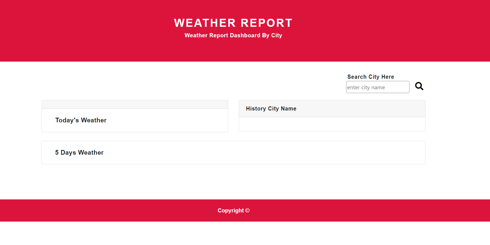
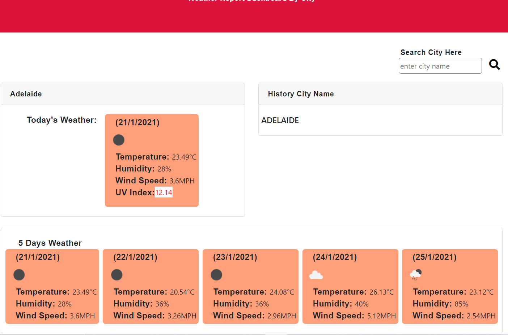
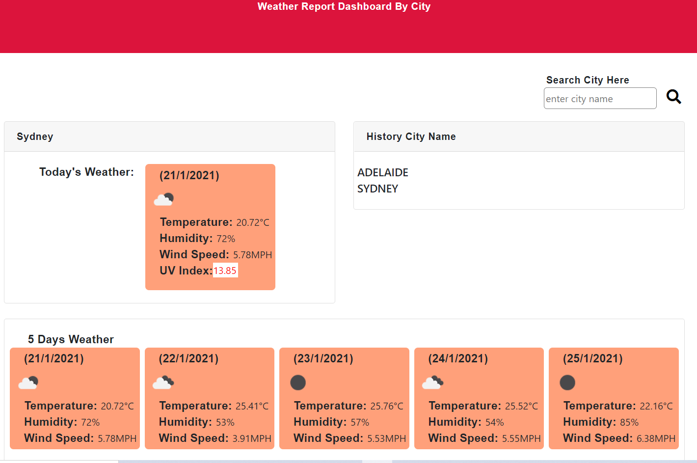
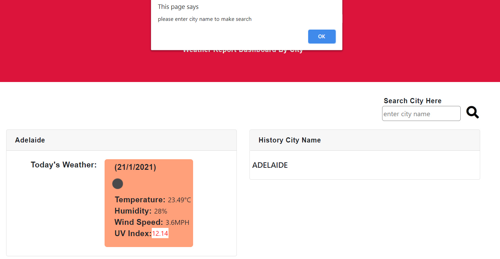
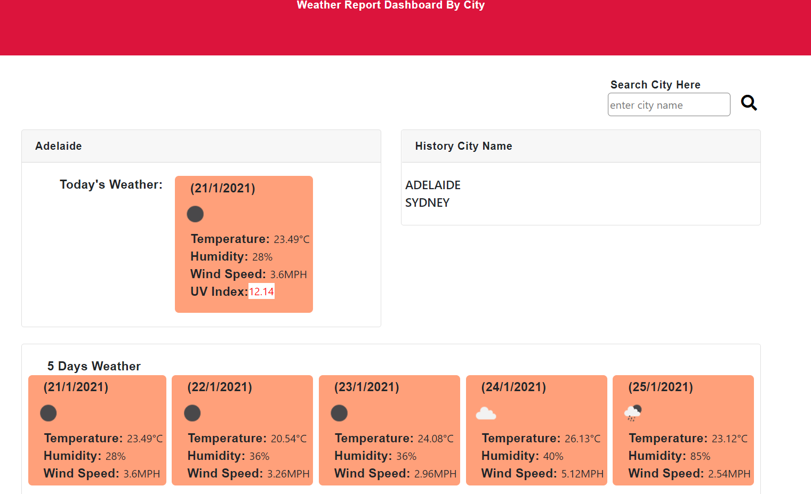

# weather-report

# INDRODUCTION

This web application is focused to display the weather of entered city by user. Overall, Current weather and forecast weather will display by the app. This application composed of css, js, and html file including one readme file. On app, each card will give info of weather displaying the weather icon, humidity in percentage, wind speed in MPH, temperature in degree celsius and uv in index number(only in current weather card). The user basically observe the weather condition of any city after entering the name of city on search input. User can see weather report of Adelaide as a default report in case of refresh or reload page.

# USER MANUAL
A user can search the weather information of desire city by giving the input, and able to click on search history to observe weather condition again the city previously searched.

# SCREEN SHOT OF APPLICATION

1. Application with no information

2. Display weather report

3. New Ciy added on serach History

4. Trying to search without entering city name

5. Observaing again searched city weather condition

# ENHANCEMENT

This application can be enhanced by adding numerous features like active icon, displaying more temperature info low and high. Also, can be added hourly updates of weather of city.

